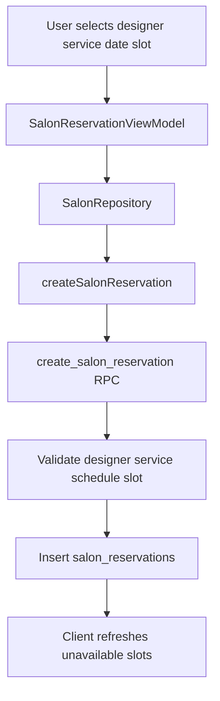

# 미용실 예약 기능 구현 계획

## 요약
미용실 예약 기능을 기존 MVVM+MVI 클린 아키텍처와 Supabase/Firebase Functions 흐름에 맞춰 구현합니다. 예약 충돌 기준은 디자이너별 시작 슬롯 1명이며, 시술 소요 시간이 길어도 시작 슬롯만 막는 정책으로 설계합니다.

## 현재 코드 기준
- 이미 [lib/core/domain/model/salon](../lib/core/domain/model/salon)에 `SalonDesigner`, `SalonService`, `SalonDesignerSchedule`, `SalonReservation` 모델이 존재합니다.
- [lib/core/data/data_source/salon/salon_data_source_impl.dart](../lib/core/data/data_source/salon/salon_data_source_impl.dart)는 `salon_designers`, `salon_services`, `salon_designer_schedules`를 조회하고 `createSalonReservation` Cloud Function을 호출합니다.
- [functions/src/index.ts](../functions/src/index.ts)에 `createSalonReservation` callable이 이미 있으며, 내부에서 `rpc/create_salon_reservation`을 호출하는 구조입니다.
- [lib/feature/salon_reservation/presentation/screen/salon_reservation_screen.dart](../lib/feature/salon_reservation/presentation/screen/salon_reservation_screen.dart)는 현재 Coming Soon UI라 실제 예약 흐름 구현이 필요합니다.

## 테이블 설계 제안
`salon_detail`에 디자이너/시술/근무표를 JSONB로 모두 넣는 방식보다는, 현재 코드가 이미 잡고 있는 정규화 테이블 구조를 유지하는 것을 권장합니다. 디자이너, 시술, 스케줄은 조회/수정/비활성화/예약 FK 검증이 자주 필요한 데이터라 JSONB보다 별도 테이블이 안전합니다.

권장 테이블은 다음과 같습니다.

- `salon_settings`
  - `store_id uuid primary key references stores(id) on delete cascade`
  - `slot_minutes int not null check (slot_minutes in (30, 60))`
  - `created_at timestamptz`, `updated_at timestamptz`
  - 이유: 슬롯 단위는 매장 정책이므로 `salon_designer_schedules.slot_minutes`에 중복 저장하지 않는 편이 일관성이 좋습니다.

- `salon_designers`
  - `id uuid primary key default gen_random_uuid()`
  - `store_id uuid not null references stores(id) on delete cascade`
  - `name text not null`, `introduction text default ''`, `image_url text default ''`
  - `is_active boolean default true`, `sort_order int default 0`
  - `created_at timestamptz`, `updated_at timestamptz`

- `salon_services`
  - `id uuid primary key default gen_random_uuid()`
  - `store_id uuid not null references stores(id) on delete cascade`
  - `name text not null`, `description text default ''`
  - `duration_minutes int not null`, `price int not null`
  - `is_active boolean default true`, `sort_order int default 0`
  - 현재 전제상 시술 항목은 매장 공통 항목으로 두고, 디자이너별 가능 시술 매핑 테이블은 만들지 않습니다.

- `salon_designer_schedules`
  - `id uuid primary key default gen_random_uuid()`
  - `designer_id uuid not null references salon_designers(id) on delete cascade`
  - `day_of_week int not null check (day_of_week between 0 and 6)`
  - `is_working boolean default true`
  - `start_time time not null`, `end_time time not null`
  - `created_at timestamptz`, `updated_at timestamptz`
  - `unique(designer_id, day_of_week)`
  - 기존 모델의 `slot_minutes`는 `salon_settings`로 이동하거나, 구현 범위를 줄이려면 임시로 유지하되 저장/검증 기준은 하나로 통일합니다.

- `salon_reservations`
  - `id uuid primary key default gen_random_uuid()`
  - `store_id uuid not null references stores(id) on delete cascade`
  - `user_id text not null references users(id)`
  - `designer_id uuid not null references salon_designers(id)`
  - `service_id uuid not null references salon_services(id)`
  - `start_at timestamptz not null`, `end_at timestamptz not null`
  - `slot_minutes int not null`, `status text not null default 'confirmed'`
  - `created_at timestamptz`, `updated_at timestamptz`
  - 핵심 제약: confirmed 예약 기준 `unique(designer_id, start_at)` 또는 partial unique index를 둡니다. 정책상 시술 시간이 겹쳐도 시작 슬롯만 막으므로 interval overlap 제약은 두지 않습니다.

## 예약 생성 흐름

- 클라이언트는 디자이너, 시술, 날짜를 선택한 뒤 `salon_settings.slot_minutes`와 해당 디자이너의 근무표로 시작 슬롯 목록을 생성합니다.
- 해당 날짜의 `salon_reservations` 중 `status = confirmed`이고 같은 `designer_id`의 `start_at`이 같은 슬롯이면 버튼을 비활성화합니다.
- 최종 예약 생성은 클라이언트 직접 insert가 아니라 Cloud Function + Postgres RPC로 처리합니다. 동시 클릭 경쟁은 DB unique index/RPC에서 막습니다.
- `end_at`은 `start_at + service.duration_minutes`로 저장하되, 예약 가능 여부 계산에는 `start_at`만 사용합니다.

## Flutter 구현 범위
- `SalonRepository`/`SalonDataSource`에 다음 기능을 추가합니다.
  - 매장별 `SalonSettings` 조회
  - 디자이너별 특정 날짜 예약 목록 조회 또는 stream
  - 필요 시 `saveMyStoreSchedules`, `saveMyStoreSettings` 추가
- `SalonReservationScreen`을 MVVM+MVI 구조로 교체합니다.
  - `salon_reservation_action.dart`: 디자이너 선택, 시술 선택, 날짜 선택, 시간 선택, 예약 버튼, 재시도, 뒤로가기
  - `salon_reservation_state.dart`: 로딩 상태, 디자이너/시술/날짜/슬롯/예약 불가 슬롯/선택값/에러
  - `salon_reservation_view_model.dart`: 데이터 로드, 슬롯 계산, 예약 불가 계산, 제출 처리
  - `salon_reservation_screen_root.dart`: ViewModel 주입 및 라우팅 처리
  - `presentation/component`: 디자이너 카드, 시술 카드, 날짜 선택 영역, 시간 슬롯 버튼, 예약 하단 버튼 분리
- `router.dart`의 기존 `SalonReservationScreen(storeId: ...)` 라우트를 `SalonReservationScope` 또는 root 위젯으로 연결합니다.
- `di_setup.dart`에 `SalonReservationViewModel` factory를 등록합니다.

## 파트너 관리 구현 범위
- 현재 [lib/feature/partner_salon_management/presentation/screen/partner_salon_management_screen.dart](../lib/feature/partner_salon_management/presentation/screen/partner_salon_management_screen.dart)는 안내 카드만 있으므로, 별도 관리 화면/VM을 단계적으로 붙입니다.
- 1차 구현은 예약 사용자가 실제 예약할 수 있도록 최소 데이터가 이미 DB에 있다고 가정할 수 있습니다.
- 2차 구현에서 파트너가 디자이너, 시술, 근무표, 슬롯 단위를 직접 저장하는 화면을 구현합니다.

## 검증 계획
- Dart 코드 생성: `dart run build_runner build --delete-conflicting-outputs`
- Flutter 정적 분석: `flutter analyze`
- Functions 빌드/린트: `npm --prefix functions run build`, `npm --prefix functions run lint`
- 핵심 수동 확인: 같은 디자이너/같은 시작 슬롯 중복 예약 실패, 다른 디자이너/같은 시작 슬롯 예약 가능, 30분/60분 슬롯 버튼 생성, 비근무 시간 비활성화

## TODOS
### id: schema-design
    Supabase 테이블/RPC/제약 조건을 디자이너별 시작 슬롯 1명 정책에 맞춰 정리한다.(completed)
### id: core-salon-api
    SalonSettings와 예약 조회/생성 API를 core data/domain/repository 레이어에 추가한다.( completed
### id: reservation-feature
    salon_reservation feature를 action/state/view_model/root/component 구조로 구현한다.(completed)
### id: routing-di
    라우터와 DI를 새 미용실 예약 root/viewModel 구조에 연결한다.(completed)
### id: partner-management
    파트너 미용실 관리 화면은 최소 예약 기능 이후 디자이너/시술/근무표/슬롯 설정 저장 흐름으로 확장한다.(completed)
### id: verification
    build_runner, flutter analyze, functions build/lint로 생성 코드와 정적 오류를 검증한다.(completed)